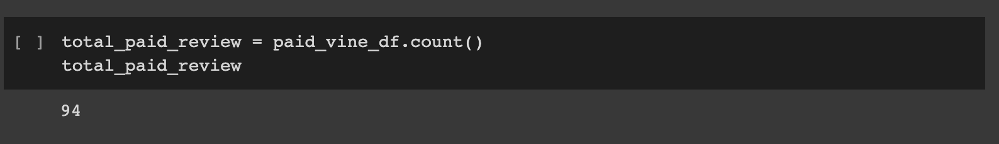
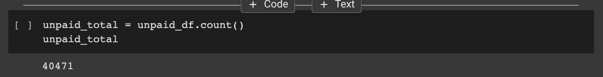
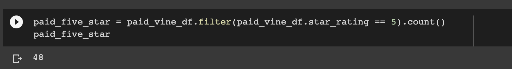
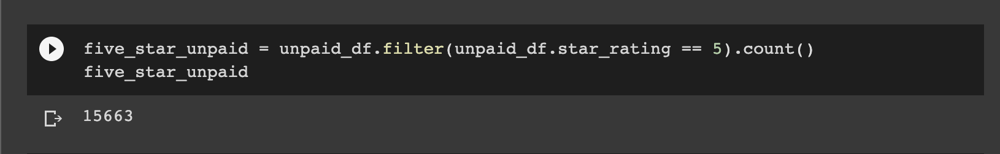
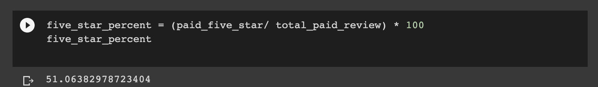
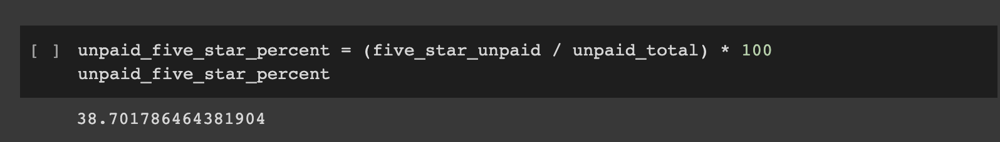

# Amazon_Vine_Analysis

### Analysis Overview
- This project allows us to analyze Amazons datasets and if there are biased data points in our data for memberbs of vine. This analysis utilizes PySpark to perform the ETL process to extract the dataset from Amazon and then we transform the data. After transforming the data we connect to AWS RDS instances and load the data into pgAdmin to find different metrics.

### Resources
- Data: Amazon Reivew datasets, Video Games Review dataset
- Software: AWS, pgAdmin, PostgreSQL, Google Colab Notebook

### Results from data
- Vine reviews

- Non-Vine reviews

### Total 5-star reviews
- Vine reviews

- Non-Vine reviews

### Percentage 5-star reviews
- Vine reviews

- Non-Vine reviews

### Data Summary
- Looking at the data we can say that 51.06% of the reviews on Vine were 5 star reviews where the percentage of non-vine reviews were only 38.7%. This tells us that there was a positive bias for reviews in vine.
- We can also say that the analysis of the statistical distribution of the (mean,median, and mode) for each rating category to find more concrete answers. 
